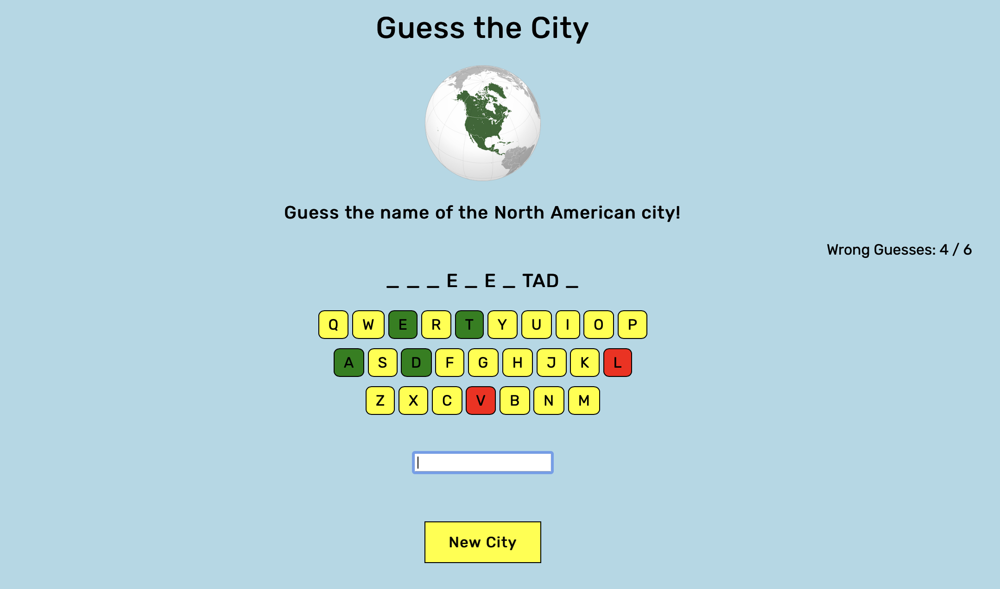

# Guess The City

### A front-end, JavaScript game to guess the name of North American cities.

 

 

### Key Features:

- Randomized array of non-repeating cities
- Keys change color when pressed down: red when the word does not contain the letter and green when it does.

### Languages, Skills, & Methods:
- Vanilla JavaScript, CSS3, HTML5
- Object-Oriented Programming
- Event Listeners
- Array Data Structures

## >> [Play the game!](https://guess-the-city-ebaright.netlify.app/) <<

### References:

- [GA Virtual Keyboard Lab](https://git.generalassemb.ly/sei-buffleheads/js-dom-virtual-keyboard)
- [Vanilla Javascript Hangman](https://github.com/simonjsuh/Vanilla-Javascript-Hangman-Game/blob/master/js/hangman.js)
- [Generate array of non-repeating elements](https://medium.com/@will.software.engineer/generate-an-array-of-unique-non-repeating-elements-in-javascript-992b585da29a)
